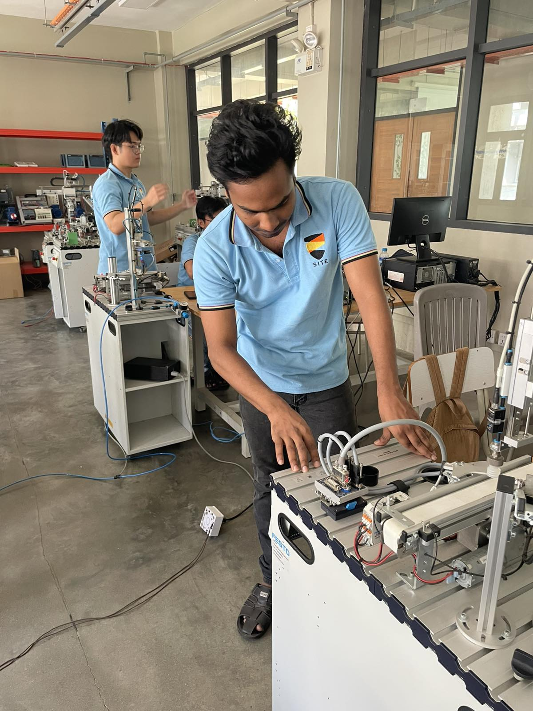
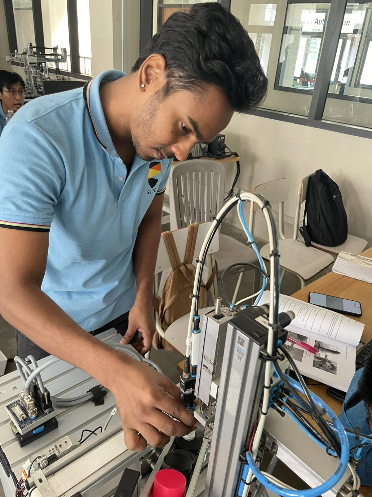
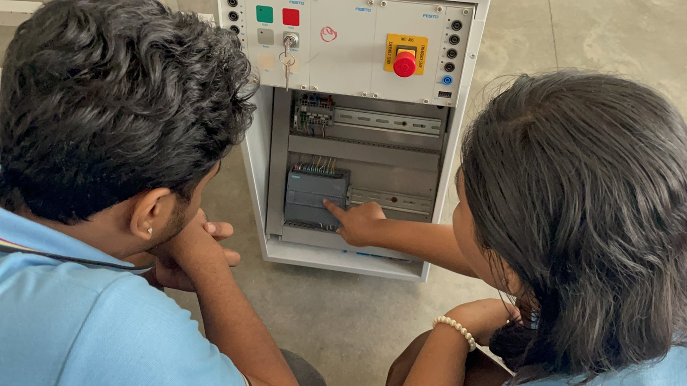

# Advanced Certificate in Industrial Automation (SITE)

## Overview

This repository documents my successful completion of the **Advanced Certificate Course in Industrial Automation** at the **School of Industrial Training and Education (SITE)**, under the Department of Technical and Vocational Education and Training, Ministry of Science and Technology, Myanmar.

The training focused on industrial automation systems, PLC programming, factory automation, process automation, pneumatic systems, industrial sensors, actuators, and hands-on implementation using industrial equipment.

---

## Certificate

📄 **Certificate**

[View Certificate](certificate/SITE_Industrial_Automation_Certificate.pdf)

---

## Academic Transcript

📄 **Transcript**

[View Transcript](docs/transcript.pdf)

---

## Course Modules

| Module | Grade |
|---------|-------|
| PLC Programming | A |
| Factory Automation | C |
| Process Automation | A |

**Overall GPA:** **3.8 / 4.0**

---

## Skills Acquired

- PLC Programming
- Siemens PLC
- Industrial Automation
- Factory Automation
- Process Automation
- Pneumatic Systems
- Electro-pneumatic Control
- Industrial Sensors
- Solenoid Valves
- Industrial Actuators
- Control Panel Wiring
- Industrial Safety
- Automation Troubleshooting

---

## Hands-on Training

During the course, I completed practical laboratory exercises including:

- PLC programming
- Industrial sensor integration
- Pneumatic cylinder control
- Solenoid valve control
- Electro-pneumatic circuits
- Industrial control systems
- Factory automation modules
- Process automation modules
- Industrial equipment troubleshooting

---

## Laboratory Photos

### Automation Workstation

---

### Pneumatic System Configuration

---

### PLC Programming Session

---

## Technologies

- Siemens PLC
- Pneumatic Systems
- Industrial Sensors
- Industrial Actuators
- Solenoid Valves
- Factory Automation Equipment
- Process Automation Equipment

---

## Related Skills

- Automation Engineering
- Mechatronics
- PLC Programming
- Industrial Control
- Electrical Systems
- Instrumentation
- Embedded Systems
- Problem Solving
- Technical Documentation

---

## Author

**Win Lwin**

Bachelor of Engineering (Mechatronics)

Incoming Master of Engineering (Electrical and Computer Engineering)

University of Windsor

GitHub: https://github.com/yourusername

LinkedIn: https://linkedin.com/in/yourprofile